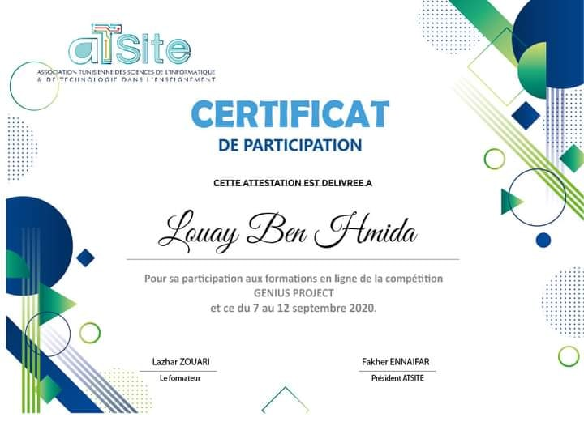
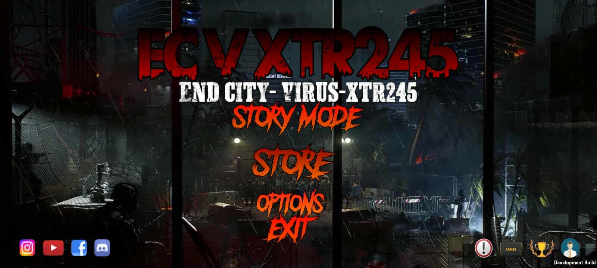
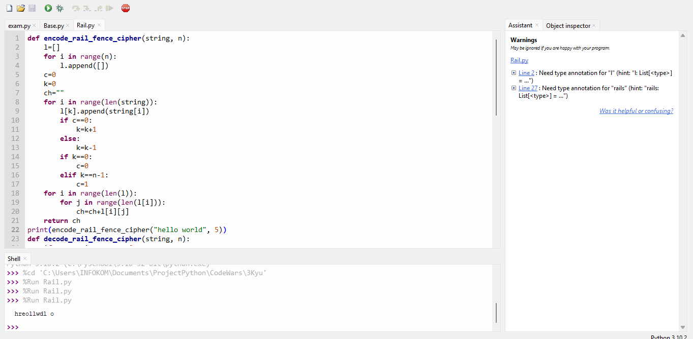
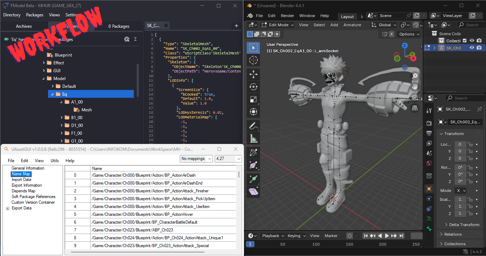
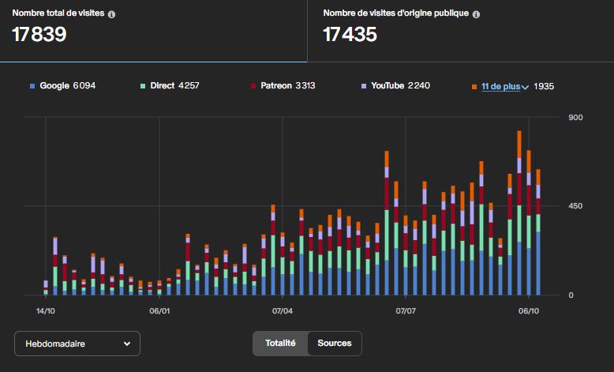
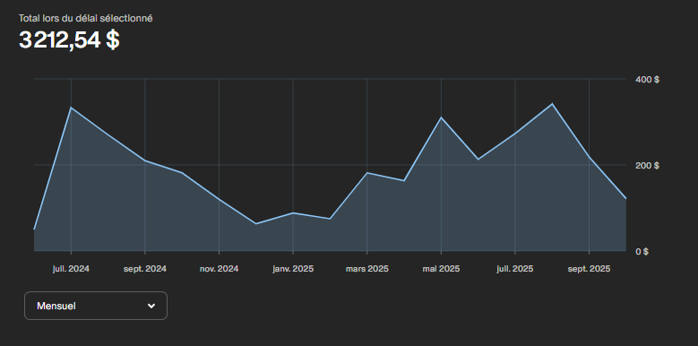

# Louay Ben Hmida – Portfolio

## 👋 À propos de moi
Bonjour, je suis **Louay Ben Hmida**, un jeune passionné d’informatique âgé de 17 ans, originaire de Tunisie. Je suis actuellement en dernière année du **Bac – Section Informatique**, avec l’objectif d’obtenir une moyenne de **16/17**.

L’informatique est pour moi bien plus qu’une matière. C’est une passion, un espace de création et un moyen de concrétiser mes idées. J’aime apprendre, développer et innover, que ce soit en programmation, en développement de jeux, en robotique ou en création de sites web.

**Langues :** Arabe (langue maternelle), Anglais (bon niveau), Français (niveau intermédiaire), Allemand (en apprentissage)  
**Compétences & outils :** Python, PyQt5, C#, Unity, Arduino (C), HTML/CSS/JS, PHP, Unreal Engine, Blender

---

## 🏆 Réalisations
- **Concours National de Développement Mobile** – 1ère place (à l’âge de 12 ans)  
  

- **Concours National de Vidéo 3D & Storytelling** – 2ème place (événement officiel, avec invitation à une émission radio)
[Certificat](source/melodie.pdf)
- **Projets Arduino & Robotique** (âges 13–16)  
  - Conception de voitures télécommandées via application Android et Bluetooth  

- **Expérience en Développement de Jeux**  
  - Projets Unity & C#, collaboration avec un studio de jeux en Égypte  

- **Projets Web**  
  - Création d’un site éducatif dédié à Arduino, incluant vidéos et simulation de code en temps réel
  – Certification en développement web [Certificat](source/web.pdf)
  – Lettre de recommandation attestant de mes compétences en développement web [Certificat](source/LettreDeRecommendationSTI.pdf)
- **Modding & Création de Contenu**  
  - Mods et leaks pour jeux vidéo, avec une page Patreon : ~3 000 USD gagnés à l’âge de 16 ans, ~800 abonnés, plus de 120 000 vues sur YouTube

- **Python & Résolution de problèmes**  
  - Plusieurs projets Python incluant des programmes mathématiques et des interfaces PyQt5

---

## 💻 Projets

### ✅ 1. Voitures Arduino télécommandées
**Description :** Voitures contrôlées via application Android et Bluetooth  
**Compétences :** Arduino (C), développement Android  
**Supports :**  

  

---

### ✅ 2. Projets Unity
**Description :** Participation à des projets d’un studio de jeux local  
**Compétences :** Unity, C#  
**Supports :**  
 

---

### ✅ 3. Site éducatif Arduino
**Description :** Plateforme d’apprentissage dédiée aux composants Arduino, avec tutoriels vidéo et simulation en temps réel  
**Compétences :** HTML/CSS/JS, PHP, Arduino  
**Supports :**  
 
  

---

### ✅ 4. Projets Python
**Description :** Programmes mathématiques et applications graphiques avec PyQt5  
**Compétences :** Python, PyQt5  
**Supports :**  
 
  

---

### ✅ 5. Mods de jeux & Reverse Engineering
**Description :** Création de mods personnalisés et gestion d’une communauté sur Patreon et YouTube  
**Compétences :** Modding, création de contenu  
**Supports :**  

  

---

## 📈 Résultats scolaires
- Toujours classé **1er en programmation** dans mon établissement  
- Exemple : Programmation : 19,34 / 20 (1er trimestre – Baccalauréat)
[YouTube](source/atsite.jpg)
- Lettres de recommandation disponibles

---

## 🎯 Objectifs
Je souhaite poursuivre des études universitaires en **Informatique** (idéalement avec bourse) et continuer à développer des projets à impact. Je veux élargir mes compétences, contribuer à des logiciels réels et explorer des opportunités de travail en parallèle de mes études.

---

## 📫 Contact
- GitHub : https://github.com/Louay-Ben-Hmida  
- Email : louayy.benhmida@gmail.com  

---

