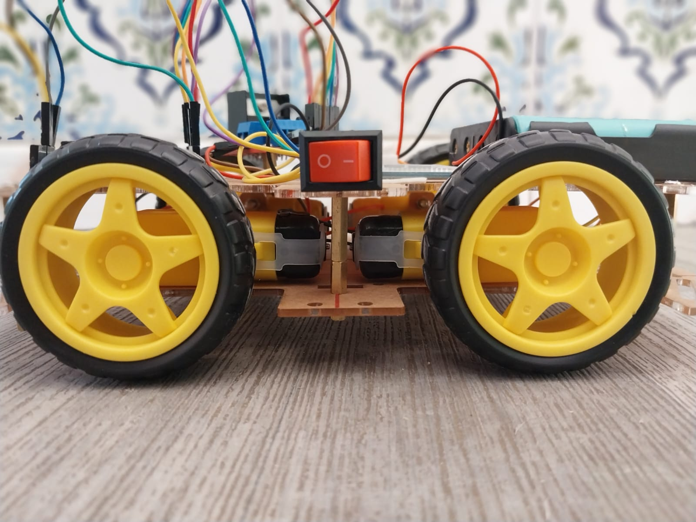
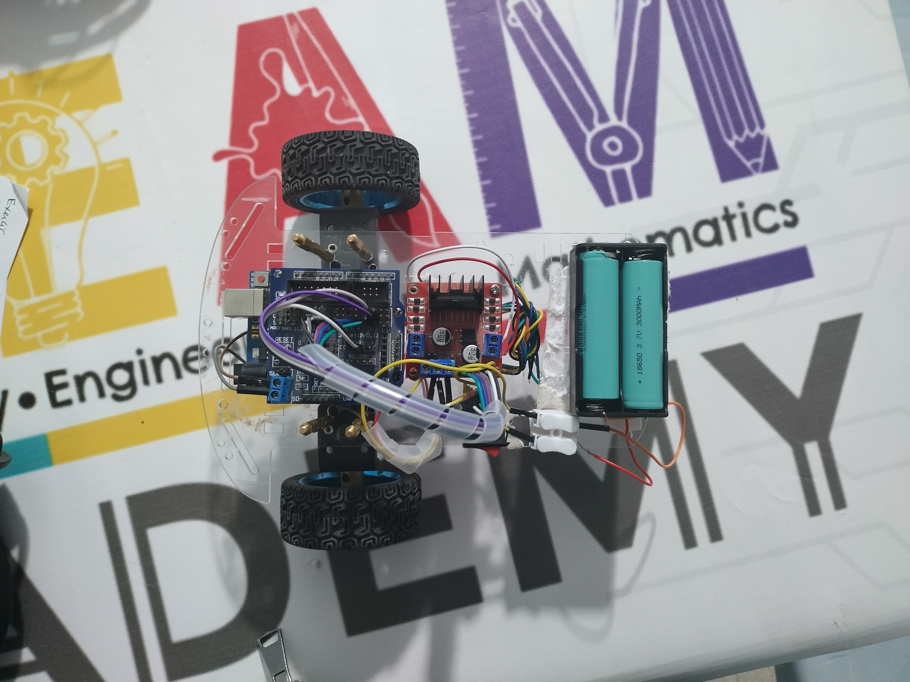

# 👋 Hi, I'm Louay  

  

---

## 🚀 About Me
- 🎓 16 y/o student, passionate about **programming, game development & robotics**  
- 🕹️ Creator of mods & custom tools for **Unreal Engine (UE4 & UE5)** and **Unity**  
- 🤖 Built my first **Arduino robot** at age 14  
- 💻 Skilled in **C, C#, HTML/CSS/JS, and reverse engineering/modding tools**  
- 🌍 Aspiring to study **Computer Science & Game Development abroad**  

---

## 🛠️ Tech Stack

  

---

## 📌 Featured Projects  

### 🔹 1. Arduino Robot Car  

  
  

  

- Controlled with **Arduino Uno & L298N**  
- Learned electronics & C programming  
- [📂 View Project](./robot-car) | [🎥 Demo Video](https://your-link.com)  

---

### 🔹 2. Game Mods & Tools (UE4/UE5)  

  

  

- Developed custom mods & assets for **My Hero Ultra Rumble & My Hero One’s Justice 2**  
- Tools: **Unreal Engine 4.27 / 5, Blender, C#, reverse engineering**  
- [📂 View Project](./mods) | [🎥 Showcase](https://your-link.com)  

---

### 🔹 3. Unity Projects & Mini-Games  

  

  

- Built **2D & 3D mini-games** in Unity  
- Implemented physics, UI, and scripting in C#  
- [📂 View Project](./unity-games) | [🎥 Demo](https://your-link.com)  

---

### 🔹 4. Website Projects

  
  

  

- Created a Website that teach how to use some arduino with tutorials videos created by me, similation and level test 
- Learned html/css/js/php
- [📂 View Project](./robot-car) | [🎥 Demo Video](https://your-link.com)  

---
## 📊 GitHub Stats

  
  

---

## 📫 Contact
- 📧 Email: your@email.com  
- 🌐 Portfolio Website: [your-website.com](https://your-website.com)  
- 💼 LinkedIn: [Your Name](https://linkedin.com/in/yourprofile)  

---

  <i>"Learning by building — from Arduino bots to Unreal worlds."</i>

